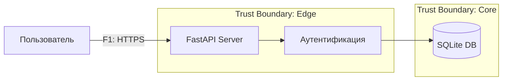

```mermaid
flowchart LR
  U[Пользователь] -->|F1: HTTPS| API[FastAPI Server]
  subgraph Edge[Trust Boundary: Edge]
    API --> AUTH[Аутентификация]
  end
  subgraph Core[Trust Boundary: Core]
    AUTH --> DB[(SQLite DB)]
  end
```
